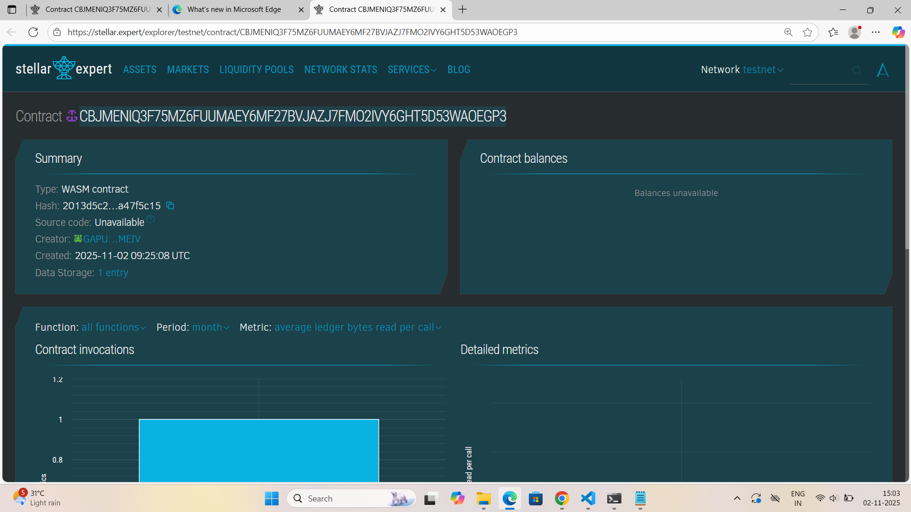

# Decentralized URL Shortener

## Project Title

**Decentralized URL Shortener on Stellar Blockchain**

A censorship-resistant, permanent URL shortening service powered by Soroban smart contracts.

---

## Project Description

The Decentralized URL Shortener is a revolutionary blockchain-based solution built on the Stellar network using Soroban smart contracts. This platform creates short links that are immutably stored on the blockchain, ensuring they cannot be censored, deleted, or hijacked by central authorities.

### The Problem We Solve

Traditional URL shorteners face several critical issues:
- **Single Point of Failure**: Centralized services can shut down, breaking millions of links
- **Censorship**: Platforms can remove links at will or under government pressure
- **Data Privacy**: User data and analytics are collected and monetized without consent
- **Link Rot**: URLs become inaccessible when services discontinue
- **Lack of Ownership**: Users don't truly own their shortened URLs
- **Trust Issues**: No way to verify if a link has been tampered with

### Our Solution

By leveraging blockchain technology, we provide:
- **Permanent Storage**: Links exist as long as the Stellar blockchain operates
- **True Ownership**: Cryptographically verified ownership of each short URL
- **Censorship Resistance**: No entity can remove or alter stored links
- **Transparency**: All URL mappings are publicly verifiable
- **Decentralization**: No central authority controls the service
- **Trust & Security**: Blockchain-based verification ensures authenticity

---

## Project Vision

Our vision is to create a **decentralized web infrastructure** where URL shortening is:

### 🌍 **Universally Accessible**
Anyone, anywhere can create and access short links without permission from centralized gatekeepers.

### 🔒 **Permanently Reliable**
Links remain functional indefinitely, solving the "link rot" problem that plagues the modern web.

### 🛡️ **Censorship-Proof**
No government, corporation, or individual can censor, remove, or manipulate links once created.

### 👥 **Community-Governed**
Future development and protocol upgrades will be determined by the community through decentralized governance.

### 💎 **Value-Preserving**
Short URLs become digital assets that users truly own and can potentially monetize.

### 🌐 **Interoperable**
Eventually expand to support multiple blockchains, creating a cross-chain URL resolution protocol.

We envision a future where critical information links cannot be suppressed, where digital content remains permanently accessible, and where users have complete sovereignty over their URL infrastructure.

---

## Key Features

### 🔗 **Immutable Link Creation**
Create short URLs that are permanently stored on the Stellar blockchain. Once a URL mapping is written to the blockchain, it becomes part of the immutable ledger, ensuring the link will exist as long as the network operates. No one—not even the original creator—can delete or modify the mapping without proper authorization.

### 🔐 **Cryptographic Ownership**
Each short URL is tied to the creator's Stellar address through cryptographic signatures. The `require_auth()` function ensures that only authenticated users can create links, providing verifiable ownership and accountability. This ownership is transparent and can be verified by anyone on the blockchain.

### 📊 **On-Chain Analytics**
Track usage statistics including click counts directly on the blockchain. Every time a URL is resolved, the click counter increments and this data is stored immutably on-chain. This provides transparent, tamper-proof metrics without relying on third-party analytics services.

### 🚀 **Custom Short Codes**
Users have complete freedom to choose their own memorable short codes (subject to availability). This enables branded links like "yourcompany/promo" or "event/tickets2024", making links more recognizable and trustworthy for end users.

### 🌐 **Censorship Resistance**
Once a URL mapping is stored on the Stellar blockchain, it cannot be censored or removed by governments, corporations, or platform administrators. The decentralized nature of blockchain ensures that no single entity has the power to suppress information.

### ⚡ **Fast Resolution**
Leverage Stellar's high-performance blockchain infrastructure for quick URL resolution with minimal latency. Stellar's 3-5 second transaction finality means your URLs are created and accessible almost instantly.

### 🔍 **Transparent & Verifiable**
All URL mappings are publicly accessible on the blockchain. Anyone can verify when a link was created, who created it, and how many times it has been accessed. This transparency builds trust and prevents fraudulent activity.

### 💰 **Cost-Effective**
Stellar's extremely low transaction fees (fractions of a cent) make it economically viable to create thousands of short URLs without breaking the bank, unlike expensive gas fees on other blockchains.

---

## Future Scope
#### Link Expiration
- Implement optional time-based expiration for temporary links
- Allow creators to set expiration dates (1 day, 1 week, 1 month, custom)
- Automatic cleanup of expired links to optimize storage
- Notification system for expiring links

#### Update Mechanism
- Enable creators to update destination URLs while maintaining the same short code
- Version history tracking for URL changes
- Rollback functionality to previous URL versions
- Update authorization with multi-signature support

#### Transfer Ownership
- Allow secure transfer of URL ownership to other Stellar addresses
- Implement transfer approval mechanism
- Batch transfer functionality for multiple URLs
- Transfer history logging

#### Batch Creation
- Support for creating multiple short URLs in a single transaction
- CSV import functionality for bulk URL creation
- Reduced transaction costs through batching
- Progress tracking for large batch operations

---

### 📈 **Phase 2: Advanced Analytics & Insights** (Q3 2025)

#### Geographic Tracking
- Privacy-preserving geographic data collection
- Store country/region-level access data on-chain
- Heatmap visualization of global URL access patterns
- GDPR and privacy regulation compliance

#### Referrer Analytics
- Track traffic sources for each short link (social media, email, direct, etc.)
- Top referrer identification and ranking
- Referrer-based filtering and reporting
- Integration with popular analytics platforms

#### Time-Series Data
- Historical access patterns and trend analysis
- Peak usage time identification
- Seasonal pattern detection
- Predictive analytics for link performance

#### Custom Analytics Dashboard
- User-friendly web interface for visualizing link performance
- Real-time analytics updates
- Exportable reports (PDF, CSV, JSON)
- Customizable widgets and data views
- Mobile-responsive design

CONTRACT DETAILS -

CONTRACT ID - CBJMENIQ3F75MZ6FUUMAEY6MF27BVJAZJ7FMO2IVY6GHT5D53WAOEGP3
